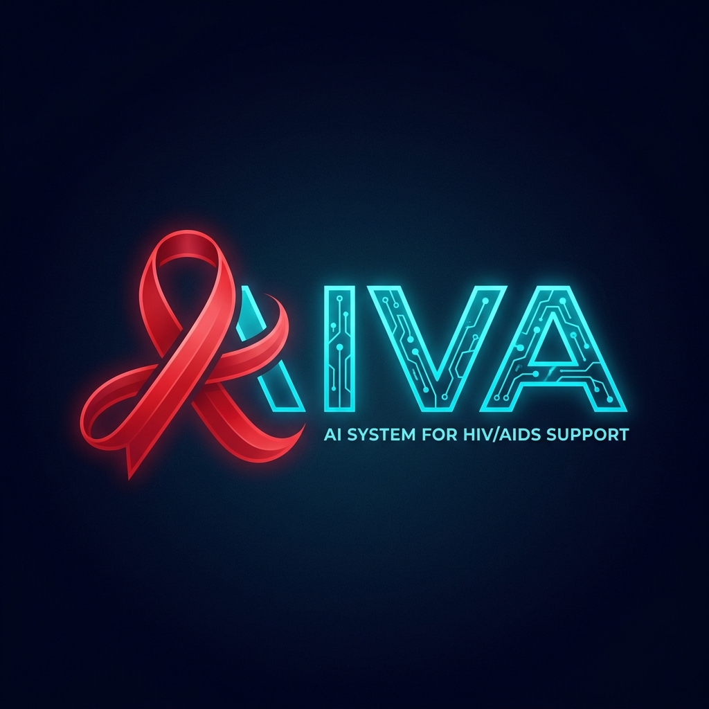

<div align="center">
  

  <h3 align="center">AI System for HIV/AIDS Support</h3>

  <p align="center">
    Nền tảng trí tuệ nhân tạo chuyên biệt đồng hành cùng chuyên gia và cộng đồng trong công tác phòng chống HIV/AIDS.
    <br />
    <a href="https://github.com/vnaiva/aiva-platform"><strong>Khám phá mã nguồn »</strong></a>
    <br />
    <br />
    <a href="#-tổng-quan">Tổng quan</a>
    ·
    <a href="#-kiến-trúc-hệ-thống">Kiến trúc</a>
    ·
    <a href="#-tính-năng-cốt-lõi">Tính năng</a>
    ·
    <a href="#-cài-đặt--vận-hành">Cài đặt</a>
  </p>
</div>

---

## 🌟 Tổng quan

**AIVA** không chỉ là một chatbot đơn lẻ. Đây là một **nền tảng trợ lý AI chuyên biệt cho lĩnh vực HIV/AIDS**, vận hành theo mô hình đa người dùng (Multi-tenant), đa vai trò (Multi-role) và đa nhiệm vụ (Multi-task).

AIVA cung cấp một hệ sinh thái an toàn, bảo mật giữa:
1. **Người dùng (Cộng đồng)**: Tìm kiếm sự tư vấn an toàn, ẩn danh.
2. **Nhân viên (Staff)**: Sử dụng AI để tối ưu hóa quy trình, hoàn thành nghiệp vụ.
3. **Huấn luyện viên (Trainer - Chuyên gia)**: Lấp đầy tri thức và kiểm soát rủi ro thông tin.
4. **Quản trị viên (Admin)**: Số hóa quy trình, giám sát và phân quyền bảo mật.

---

## 🏗️ Kiến trúc Hệ thống

AIVA ứng dụng mô hình Serverless hiện đại trên nền tảng Next.js kết hợp cùng công nghệ Trí tuệ Nnhân tạo Tạo sinh (Generative AI), RAG (Retrieval-Augmented Generation) và kiến trúc PostgreSQL tiên tiến.

### Công nghệ cốt lõi

*   **Bộ khung (Framework)**: Next.js 14+ (App Router)
*   **Giao diện**: TailwindCSS v4, Lucide Icons, Shadcn UI (Custom)
*   **AI Engine**: Vercel AI SDK v6
*   **Ngôn ngữ lớn (LLM)**: Gemma 4 - 31B Parameter (qua provider OpenAI-compatible định cấu hình tùy chọn)
*   **Cơ sở dữ liệu**: Supabase (PostgreSQL + pgvector để lưu trữ tri thức RAG)
*   **Bảo mật**: Row-Level Security (RLS) của Supabase, RBAC (Role-Based Access Control)
*   **Hosting**: Vercel (Edge Network & Serverless Computing)

---

## 🎯 Tính năng Cốt lõi & Cấu trúc Mô-đun

AIVA được phân thành 4 Không gian (Workspaces) biệt lập theo đúng nguyên tắc **"Quyền hạn tối thiểu - Trải nghiệm tối đa"**.

### 1. 🟢 AIVA Care (Dành cho Cộng đồng) `[ /care ]`
*   **Tư vấn Ẩn danh**: Trò chuyện không bắt buộc đăng nhập, giải tỏa tâm lý lo âu.
*   **Luồng Đồng thuận Chuyển tuyến (Consent Flow)**: Tích hợp logic xin phép và thu thập dữ liệu tự động để gửi ca tư vấn đến khu vực y tế phù hợp (CBO, VCT) nếu người dùng có nhu cầu.
*   *Giao diện Clean, Typography rõ ràng, tạo sự tĩnh tâm tối đa.*

### 2. 🔵 AIVA Staff (Dành cho Nhân viên) `[ /staff ]`
Không gian này yêu cầu quyền đăng nhập. Tích hợp 8 Trợ lý AI đặc quyền tương ứng với 8 vai trò (Modules):
1.  **CBO**: Không gian tư vấn tiếp cận cộng đồng.
2.  **VCT**: Hỗ trợ quy trình Sàng lọc & Tư vấn xét nghiệm tự nguyện.
3.  **OPC**: Hỗ trợ quy trình khám, điều trị bằng thuốc kháng virus (ARV).
4.  **XNKĐ**: Chuyên cho nghiệp vụ phòng Xét nghiệm Khẳng định.
5.  **Surveillance**: Phân tích, tổng hợp số liệu giám sát dịch tễ học.
6.  **Management**: Báo cáo tổng hợp, tóm tắt điều hành cho cấp Lãnh đạo.
7.  **Communications (Truyền thông)**: Xây dựng tài liệu tập huấn, ấn phẩm truyền thông sức khỏe.
8.  **IT Support**: Hỗ trợ giải đáp, khắc phục quy trình số lỗi khi thao tác nhập liệu các hệ thống (như HMED).

### 3. 🟡 Trainer Workspace (Khu vực Huấn luyện) `[ /trainer ]`
Nơi các chuyên gia kiểm soát tri thức mà AIVA trả lời ra bên ngoài.
*   **Kho Tri thức (Knowledge Base)**: Quản lý RAG, nạp các văn bản quy phạm, phác đồ mới nhất.
*   **Cơ chế AI Hỏi ngược (AI Fallback)**: Giám sát những trường hợp AI trả lời rủi ro hoặc thiếu thông tin, từ đó thiết lập *Standard Operating Procedure (SOP)* hoặc bổ sung thêm dữ liệu.

### 4. 🔴 Admin Console (Khu vực Quản trị) `[ /admin ]`
*   **Quản lý Tài khoản (Users)**: Cấp và thu hồi quyền, phân tuyến cho Staff.
*   **Nhật ký Hệ thống (Audit Logs)**: Giám sát an ninh, theo dõi các tác vụ truy vấn dữ liệu nhạy cảm theo tiêu chuẩn bảo vệ quyền riêng tư người bệnh.
*   **Checklist QA**: Bộ kiểm thử UI tự động.

---

## ⚙️ Cài đặt & Vận hành

### Yêu cầu khởi tạo
*   Node.js >= 18.x
*   Tài khoản Supabase (Tạo Project, thiết lập khóa).
*   Tài khoản cấu hình LLM Key (như chia Sẻ GPU hoặc OpenAI).

### Các bước cài đặt

**1. Clone dự án**
```bash
git clone https://github.com/vnaiva/aiva-platform.git
cd aiva-platform
```

**2. Cài đặt Dependencies**
```bash
npm install
```

**3. Khởi tạo Biến môi trường**
Tạo file `.env.local` ở gốc thư mục:
```env
NEXT_PUBLIC_SUPABASE_URL=https://<your-id>.supabase.co
NEXT_PUBLIC_SUPABASE_ANON_KEY=eyJhb...
SUPABASE_SERVICE_ROLE_KEY=eyJhb...

GEMMA_API_KEY=sk-xxxx-xxxx
GOOGLE_GENERATIVE_AI_API_KEY=AIza-... (Tùy chọn)

NEXT_PUBLIC_SITE_URL=http://localhost:3000
```

**4. Khởi chạy Phát triển (Dev Mode)**
```bash
npm run dev
```
Trình duyệt sẽ mở tại `http://localhost:3000`

### Build cho cấp độ Sản xuất (Production)
```bash
npm run build
npm run start
```

---

## 🔒 Quy chuẩn Bảo mật

Dự án tuân theo tiêu chuẩn chặt chẽ để bảo vệ quyền riêng tư người nhiễm HIV/AIDS:
1.  **Chống dò rỉ**: API Route bảo vệ 2 lớp (Token Middleware + RLS Database).
2.  **Tracking**: Log lại mọi sửa đổi cấp độ User bằng System Logs.
3.  **Tách biệt Data**: Dữ liệu RAG và Dữ liệu Referral được bảo quản độc lập trong Postgres, mã hóa End-to-End ở cấp độ giao tiếp mạng.

---

<div align="center">
  <p>Được phát triển với mục tiêu đồng hành cùng sự phát triển khỏe mạnh của cộng đồng ❤️.</p>
</div>
